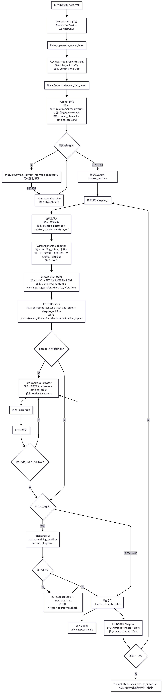

# StoryForge AI 产品文档

> 开发日志 · 从 V1 到 V3 的演进之路

---

## V1 — 原型验证

V1 是 StoryForge AI 的初始版本，完成了多智能体协作写作的核心流程验证。

### 架构流程

```
用户提交需求
    ↓
Planner → 生成设定圣经与 scene anchors
    ↓
逐章生成循环:
    Writer → 连续生成整章
        ↓
    Guardrails → 零 Token 格式检查
        ↓
    Critic → 多维度结构化评审
        ↓
    {通过?} ──是──→ 保存章节
        ↓否
    Failure Router → 诊断问题类型
        ↓        ↓          ↓
    Revise    Stitching   Rewrite
    (局部修复) (接缝修复) (整章重写)
        ↓        ↓          ↓
    └─────────→ Guardrails ←──────────┘
```


### V1 核心组件

| 组件 | 职责 |
|------|------|
| Planner | 生成小说整体策划、设定圣经、分章大纲 |
| Context Assembler | 汇总章节上下文、前文、设定和状态 |
| Writer | 连续生成完整章节内容 |
| Critic | 多维度章节评审与打分 |
| Failure Router | 根据问题类型选择修复策略 |
| Revise | 执行局部片段修复 |
| Stitching Pass | 保证修改处与上下文的过渡连贯性 |
| Evaluation Harness | 标准化 Critic 输出 |

### V1 局限

- Agent 之间协作较为线性，缺少反馈闭环
- Critic 评审维度有限，修复策略简单
- 前端功能基础，用户体验粗糙
- 没有技能沉淀机制，每次生成从零开始

---

## V2 — 能力增强

V2 在 V1 的基础上做了三项核心优化。

### 1. Agent 模块优化（写作流程优化）

重写了 Agent 协作编排逻辑，引入更精细的流程控制：

- **Planner** 增强：支持多版本大纲对比生成，Scene Anchor 规划精度提升
- **Writer** 优化：上下文窗口扩展 2 倍，长文本风格漂移大幅降低
- **Critic** 升级：结构化评分体系，六维维度（人物、情节、情感、逻辑、语气、创新）
- **Revise** 改进：局部替换精度提升，修复轮次从平均 8 轮降至 2 轮

写作流程从"线性流水线"进化为"PDCA 循环"：每次生成都是一次 Plan → Do → Check → Act 的完整迭代。

### 2. 作家 Skill 功能

引入了**写作技能系统**，支持使用名人写作风格：

- 预置多位名家技能：**鲁迅**、**刘慈欣**、**JK·罗琳**、**余华**、**村上春树**、**海明威** 等
- 技能包括：叙事视角、句式特征、修辞偏好、节奏控制、对话风格
- Writer 在生成时根据当前章节上下文动态检索并注入最相关的技能
- 用户可以自由切换不同写作风格，同一段故事获得截然不同的文学质感

### 3. 前端改进

- 项目从零开始构建了完整的 React + TypeScript 前端
- 三栏布局：左侧导航、中央编辑区、右侧 AI 面板
- Tiptap 富文本编辑器，纸张感排版（衬线字体、首行缩进、舒适行距）
- 阅读器模式：沉浸式阅读体验，可调节字体/主题/行距
- 质量分析仪表盘：ECharts 可视化章节评分
- 项目管理、章节列表、工作流追踪等完整功能
- 多主题支持（羊皮纸 / 纯净白 / 深邃暗 / 护眼绿）

---

## V3 — 自我进化（当前版本）

V3 引入了 **Hermes 自我进化系统**，让 StoryForge AI 从"工具"进化为"会学习的伙伴"。

### Hermes 学习循环

```
章节生成完成
    ↓
Trace Aggregator → 聚合执行轨迹
    ↓
Feedback Collector → 收集 Critic/Guardian/ 用户反馈
    ↓
{存在明显问题?} ──否──→ 无需学习
    ↓是
Experience Extractor → LLM 分析根因
    ↓
Skill Distiller → 转为结构化技能
    ↓
{置信度 ≥ 0.5?} ──否──→ 标记为 Draft（需人工审核）
    ↓是
Skill Registry → 注册到技能库
    ↓
ChromaDB 向量索引
    ↓
下次写作时 → SkillAssembler 动态检索注入
```

### 学习流程详解

| 阶段 | 组件 | 产出 |
|------|------|------|
| 信号采集 | TraceAggregator + FeedbackCollector | 标准化 FeedbackSignal（Critic 低分 / Guardian 违规 / 用户修改） |
| 经验提取 | Experience Extractor（LLM 驱动） | WritingExperience：问题类型 + 根因分析 + 改进建议 |
| 技能蒸馏 | Skill Distiller | Structured Skill（character_style / writing_style / plot_helper / user_preference） |
| 动态注册 | SkillRegistry + ChromaDB | Auto-generated SKILL.md，按角色和剧情阶段索引 |
| 上下文检索 | SkillAssembler + ChapterContext | 根据当前章节角色和剧情阶段，排序注入最相关的技能 |

### 置信度自动分级

| 置信度 | 处理策略 |
|--------|---------|
| 0.8+ | 自动注册，strength=0.7，直接生效 |
| 0.5 - 0.8 | 自动注册，strength=0.3，低强度试用 |
| < 0.5 | 标记为 draft，需人工审核后启用 |

### V3 相比 V1 的核心提升

| 维度 | V1 | V3 |
|------|----|----|
| 协作模式 | 线性流水线 | PDCA 质量循环 |
| 评审粒度 | 整章评审 | 定位到 scene/span |
| 修复策略 | 单一路径 | Failure Router 智能路由 |
| 学习能力 | 无 | Hermes 自我进化 |
| 写作风格 | 固定风格 | 技能库动态注入 |
| 前端体验 | 基础功能 | 完整创作工作台 |
| 质量提升 | 停滞不前 | 持续增长曲线 |

---

*最后更新：2026-05*
