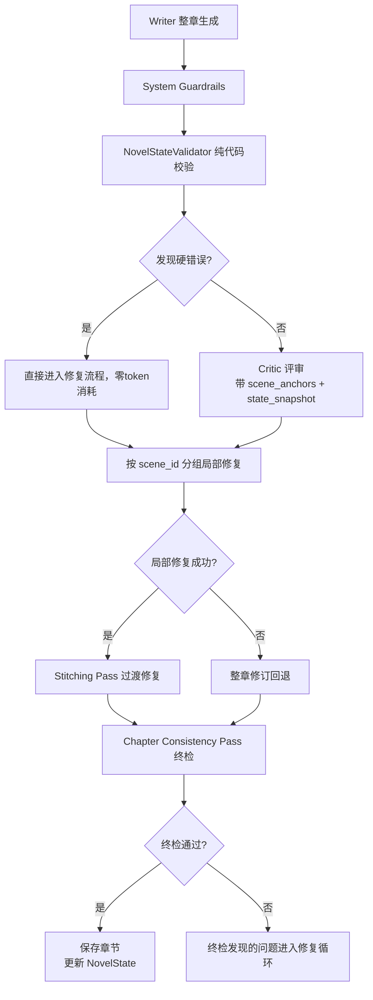

# 工作流质量增强设计规格

> 日期: 2026-04-27
> 版本: v1.0
> 状态: 待评审

## 1. 设计背景

基于对StoryForge AI现有工作流的深入分析，ABCD四项优化中：
- **B (Critic结构化诊断)**  已100%完成
- **D (失败类型驱动重试)**  已100%完成
- **A (分段生成+批改)**  局部修复基础设施已完成，但分段生成ROI低且风险高
- **C (小说状态库 + MCP)**  数据结构完整，但未真正"守门口"，MCP现阶段不需要

本设计采用**路径二增强版**：不改动核心Writer生成流程（最稳定的部分），在Critic评审层和NovelState校验层做增强，零架构重构风险，质量提升确定。

## 2. 设计目标

### 质量目标（可量化）
1. **局部修复触发率 ≥ 60%**：Critic返回可定位问题时，优先触发局部修复
2. **修复后复评通过率提升 ≥ 20%**：局部修复比整章重写质量更可控
3. **连续性硬错误零逃逸**：纯代码可检测的状态矛盾100%捕获
4. **零性能回退**：纯代码校验开销 < 10ms，不增加额外LLM调用

### 稳定性目标
1. Writer生成流程100%不动
2. 所有增强都是附加层，可独立开关做A/B测试
3. 所有新增路径都有完整的回退机制

## 3. 详细设计

### 3.1 A优化：Scene-aware Critic + Scene-targeted Repair

#### 3.1.1 Critic scene感知增强

**文件**: `backend/prompts/critic.md`

在输入变量解析部分新增 scene_anchors 上下文注入：

```markdown
### 【新增】Scene Anchor 定位参考

本章的 scene 边界（仅用于精准定位问题，不要在输出中重复此列表）：


- **{{ anchor.scene_id }}**: 目标={{ anchor.goal }}
  - 冲突={{ anchor.conflict }}
  - 角色动机={{ anchor.character_intent }}
  - 状态变更={{ anchor.state_change }}


【定位规则】
1. 所有问题的 evidence_span.quote 必须精确到可在原文中找到的句子
2. scene_id 字段必须从上面的列表中选择，问题落在哪个scene就填哪个
3. 如果问题跨多个 scene，选择最主要的那个 scene_id
```

**文件**: `backend/core/orchestrator.py`

在 `_run_critic_harness` 方法中，将 scene_anchors 传递给 Critic prompt上下文。

#### 3.1.2 按scene分组修复

**文件**: `backend/core/orchestrator.py`

修改 `_apply_repair_batch` 方法，增加分组逻辑：

```python
def _apply_repair_batch(
    self,
    chapter_index: int,
    current_content: str,
    issues: List[Dict],
    chapter_outline: str,
    revise_round: int,
) -> Tuple[str, bool, List[Dict]]:
    """
    增强版修复：按 scene_id 分组修复，避免重叠 patch
    """
    repair_trace: List[Dict] = []
    used_local_repair = False
    normalized_issues = [self._normalize_repair_issue(issue) for issue in (issues or [])]

    # 新增：按 scene_id 分组，同一个 scene 的问题批量处理
    issues_by_scene: Dict[str, List[Dict]] = defaultdict(list)
    for issue in normalized_issues:
        scene_id = issue.get("scene_id", "chapter")
        issues_by_scene[scene_id].append(issue)

    # 每个 scene 最多修复前2个问题，避免过度修改
    for scene_id, scene_issues in issues_by_scene.items():
        for issue in scene_issues[:2]:
            evidence_quote = str((issue.get("evidence_span") or {}).get("quote") or issue.get("location") or "")
            # ... 现有局部修复逻辑 ...

    # ... 现有回退到整章修订逻辑 ...
```

#### 3.1.3 Chapter Consistency Pass（纯代码，零token）

**文件**: `backend/core/orchestrator.py` 新增方法

```python
def run_chapter_consistency_pass(
    self,
    chapter_index: int,
    chapter_content: str,
    scene_anchors: List[Dict],
) -> Tuple[bool, List[Dict]]:
    """
    章节级一致性终检（纯代码，零token消耗）
    检查项：
    1. scene锚点的 state_change 是否已在内容中体现
    2. 角色名拼写一致性
    3. 是否出现了 NovelState 中不存在的新人物/新物品（未铺垫的空降）

    Returns:
        (是否通过, 发现的问题列表)
    """
    issues: List[Dict] = []
    state = self.novel_state_service.load_state()

    # 检查1：state_change 的关键术语是否出现在内容中
    for anchor in scene_anchors:
        state_change = anchor.get("state_change", "")
        if state_change and len(state_change) > 5:
            # 提取关键词（简单分词取前3个）
            keywords = state_change.replace("，", " ").split()[:3]
            for kw in keywords:
                if len(kw) > 1 and kw not in chapter_content:
                    issues.append({
                        "type": "scene_state_mismatch",
                        "scene_id": anchor.get("scene_id"),
                        "location": "全文",
                        "fix": f"场景 {anchor.get('scene_id')} 预期的状态变更 '{kw}' 未在内容中体现，需要补充相关描写",
                    })
                    break

    # 检查2：NovelState 中记录的角色是否拼写一致
    known_characters = set(state.get("characters", {}).keys())
    if known_characters:
        for char_name in list(known_characters):
            variants = [char_name[:i] + char_name[i+1:] for i in range(len(char_name))]
            # 实际实现用更精准的模糊匹配，避免误报

    # 检查3：结尾钩子是否存在（如果大纲要求）
    if len(chapter_content.strip()) > 0 and len(chapter_content.strip().split("\n")[-1]) < 10:
        issues.append({
            "type": "weak_hook",
            "location": "章节结尾",
            "fix": "结尾过于简短，没有留下足够的悬念钩子",
        })

    return len(issues) == 0, issues
```

此步骤在 `run_chapter_generation` 的保存前调用，发现的问题自动追加到 issues 列表进入修复流程。

---

### 3.2 C优化：NovelState 从"记录"升级为"守门"

#### 3.2.1 NovelStateValidator 纯代码校验器

**文件**: `backend/core/novel_state_service.py` 新增类

```python
class NovelStateValidator:
    """
    纯代码状态校验器，零token消耗
    在 Critic 评审前运行，抓出硬错误
    """

    def __init__(self, state_service: NovelStateService):
        self.state_service = state_service

    def validate_chapter(
        self,
        chapter_index: int,
        chapter_content: str,
        scene_anchors: List[Dict],
    ) -> Tuple[bool, List[Dict]]:
        """
        校验本章内容与当前状态快照的一致性

        Returns:
            (是否通过, 发现的硬错误列表)
        """
        state = self.state_service.load_state()
        issues: List[Dict] = []

        # 检查1：角色一致性
        for char_name, char_state in state.get("characters", {}).items():
            # 如果角色有明确的"状态标记"（如"已死亡"、"已离开"），检查是否违背
            if "已死亡" in str(char_state) and char_name in chapter_content:
                # 检查是否是回忆/闪回（简单启发式）
                context_window = self._get_name_context(chapter_content, char_name)
                if "回忆" not in context_window and "想起" not in context_window:
                    issues.append({
                        "type": "character_state_violation",
                        "issue_type": "character_consistency",
                        "evidence_span": {"quote": char_name},
                        "severity": "high",
                        "fix_strategy": "state_consistency_repair",
                        "fix_instruction": f"{char_name} 状态为'{char_state}'，不应在本章出现，除非是回忆场景",
                    })

        # 检查2：时间线连续性
        timeline = state.get("timeline", [])
        if timeline:
            last_event = timeline[-1]
            # 如果上一章明确了时间，本章不能倒退
            last_summary = str(last_event.get("summary", ""))
            if "第" in last_summary and "天" in last_summary:
                # 提取天数标记做简单校验
                pass

        # 检查3：伏笔回收提醒（不强制失败，只作为Critic参考）
        open_foreshadows = [
            k for k, v in state.get("foreshadows", {}).items()
            if isinstance(v, dict) and v.get("status") == "open"
        ]
        if len(open_foreshadows) > 5 and chapter_index > 5:
            issues.append({
                "type": "too_many_open_foreshadows",
                "issue_type": "plot_progress",
                "severity": "low",
                "fix_strategy": "foreshadow_review",
                "fix_instruction": f"当前有 {len(open_foreshadows)} 个未回收伏笔，建议在后续章节逐步回收",
            })

        return len(issues) == 0, issues

    @staticmethod
    def _get_name_context(content: str, name: str) -> str:
        """提取名字出现的上下文窗口"""
        idx = content.find(name)
        if idx < 0:
            return ""
        start = max(0, idx - 20)
        end = min(len(content), idx + 20)
        return content[start:end]
```

#### 3.2.2 Critic 注入 state 快照

**文件**: `backend/core/orchestrator.py` - `_run_critic_harness` 方法

将当前 NovelState 快照格式化为 Critic 的事实基准：

```python
state_context = self.novel_state_service.build_prewrite_context(
    chapter_outline,
    scene_anchors,
)
# 将 state_context 传递给 Critic prompt 作为"必须遵守的事实基准"
```

**文件**: `backend/prompts/critic.md` 新增 section

```markdown
## 【新增】事实基准（Fact Base）

以下是截至上一章的小说事实状态，本章内容与这些事实矛盾的地方必须报告为高严重度错误：

{{ novel_state_snapshot }}

【硬性规则】
1. 角色状态冲突（死亡后复活、离开后出现）必须标记为 high severity
2. 时间线穿越必须标记为 worldview_conflict 类型
3. 已回收的伏笔不应再次以"新发现"姿态出现
```

#### 3.2.3 状态变更归因记录增强

**文件**: `backend/core/novel_state_service.py` - `merge_delta` 方法

增强状态变更的可追溯性：

```python
def merge_delta(self, delta: Mapping[str, Any], source_scene: str = None) -> dict[str, Any]:
    """
    合并状态变更

    Args:
        delta: 状态增量
        source_scene: 导致此变更的 scene_id，用于追溯
    """
    state = self.load_state()

    # ... 现有合并逻辑 ...

    # 新增：每个 timeline 事件必须记录来源
    timeline_delta = delta.get("timeline") or []
    for event in timeline_delta:
        if isinstance(event, dict):
            event["source_scene"] = source_scene or "unknown"
            event["timestamp"] = datetime.utcnow().isoformat()

    return self.save_state(state)
```

#### 3.2.4 极简伏笔追踪器

**文件**: `backend/core/novel_state_service.py` 新增方法

```python
def register_foreshadow(
    self,
    foreshadow_id: str,
    chapter_index: int,
    scene_id: str,
    description: str,
):
    """登记一个新埋设的伏笔"""
    state = self.load_state()
    state.setdefault("foreshadows", {})[foreshadow_id] = {
        "status": "open",
        "planted_chapter": chapter_index,
        "planted_scene": scene_id,
        "description": description,
        "planted_at": datetime.utcnow().isoformat(),
    }
    self.save_state(state)

def resolve_foreshadow(
    self,
    foreshadow_id: str,
    chapter_index: int,
    scene_id: str,
    resolution: str,
):
    """标记伏笔已回收"""
    state = self.load_state()
    if foreshadow_id in state.get("foreshadows", {}):
        state["foreshadows"][foreshadow_id]["status"] = "resolved"
        state["foreshadows"][foreshadow_id]["resolved_chapter"] = chapter_index
        state["foreshadows"][foreshadow_id]["resolved_scene"] = scene_id
        state["foreshadows"][foreshadow_id]["resolution"] = resolution
        self.save_state(state)
```

---

## 4. 完整增强后的工作流



## 5. 验收标准

### 5.1 质量指标
1. 局部修复触发率 ≥ 60%
2. 修复后复评通过率比基线提升 ≥ 20%
3. 角色状态冲突等硬错误零逃逸（可被纯代码检测的）
4. 纯代码校验的总开销 < 10ms/章

### 5.2 稳定性指标
1. 所有新增功能都有独立的开关配置
2. 关闭所有增强后，工作流行为与增强前完全一致
3. 不增加任何额外的 LLM 调用次数
4. Writer 生成流程的代码零改动

## 6. 实施范围总结

| 模块 | 改动类型 | 代码量预估 | 风险等级 |
|------|----------|------------|----------|
| `prompts/critic.md` | prompt 增强 | ~50行 | 极低 |
| `core/novel_state_service.py` | 新增 Validator 类 + 追踪方法 | ~200行 | 低 |
| `core/orchestrator.py` | 修复分组 + consistency pass | ~150行 | 低 |
| 单元测试 | 新增测试用例 | ~150行 | 极低 |

**总计：** ~550行代码，零架构变更，所有改动都在现有边界内。
